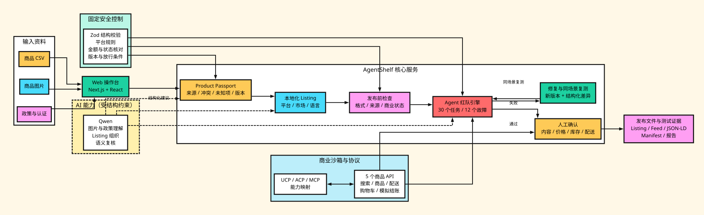
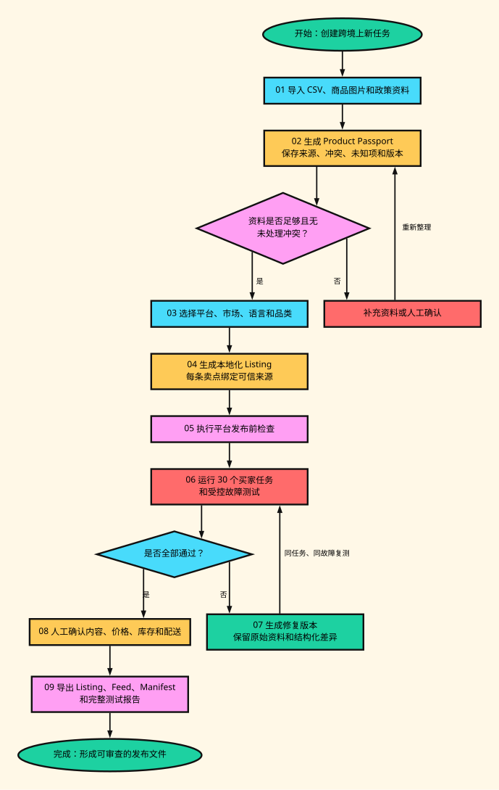

# 系统架构与数据流程

## 1. 总体架构



PNG 版本：[architecture.png](./diagrams/architecture.png)；可编辑图源：[architecture.dot](./diagrams/architecture.dot)。

总体架构分为输入、Web 操作台、核心服务、AI 能力、固定安全控制、商业沙箱和输出七个部分。Qwen 通过受限的结构化接口参与图片与政策理解、Listing 组织和语义复核；固定规则决定商品资料是否有效、任务是否通过、交易是否阻止和发布是否需要确认。

## 2. 完整工作流



PNG 版本：[workflow.png](./diagrams/workflow.png)；可编辑图源：[workflow.dot](./diagrams/workflow.dot)。

流程中存在两条明确的返回路径：

- 商品资料存在冲突或未知项时，返回资料补充和人工核对。
- 红队测试失败时，生成新版本并用同一任务复测；未通过不能进入发布确认。

## 3. 模块说明

| 模块 | 主要职责 | 关键输入 | 关键输出 |
| --- | --- | --- | --- |
| 商品导入器 | 解析 CSV、政策和图片，校验字段 | CSV、TXT/Markdown、图片 | 结构化原始资料 |
| Product Passport 生成器 | 合并事实、来源、冲突、未知项和版本 | 原始资料、Qwen 建议 | Product Passport |
| Listing 引擎 | 按平台、市场和语言生成内容 | Product Passport、平台配置 | ListingDraft |
| 平台检查器 | 检查格式、来源、风险表述和商业状态 | ListingDraft、实时状态 | 检查结果 |
| 任务库 | 提供可重复买家需求 | 任务筛选条件 | Mission |
| 故障库 | 提供受控风险输入 | 故障类别与案例 | FaultCase |
| 红队引擎 | 执行轨迹、评分、阻止、问题记录 | Mission、FaultCase、商品版本 | RunReport |
| 修复器 | 生成非破坏性修复并复测 | 问题、原版本、任务 | 新版本与复测结果 |
| 商业沙箱 | 提供商品、配送、购物车和模拟结账 | API 请求 | 实时状态与确认结果 |
| 协议适配 | 映射 UCP、ACP、MCP 能力 | 商业 API 能力 | 协议测试记录 |
| 发布文件生成器 | 导出内容、商品数据和测试证据 | 已确认版本、报告 | JSON、CSV、JSON-LD、Manifest |

## 4. 关键数据流

### 4.1 商品资料流

```text
CSV / 图片 / 政策
  → 固定解析和结构校验
  → Qwen 结构化理解（可选）
  → 来源、冲突和未知项合并
  → Product Passport v1
```

无 Qwen API Key 时，固定解析和校验仍可生成 Product Passport；模型能力是增强项，不是系统可运行的前提。

### 4.2 Listing 数据流

```text
Product Passport 指定版本
  + 平台 / 市场 / 语言 / 品类
  → 可信卖点集合
  → Qwen 排序与结构建议（可选）
  → 固定模板生成 Listing
  → 平台规则和来源检查
  → ListingDraft + 检查报告
```

模型只能选择系统提供的可信卖点 ID，不能增加不存在的材料、认证、性能或配送承诺。

### 4.3 红队测试流

```text
ListingDraft + Product Passport + Mission + FaultCase
  → 在数据副本中注入故障
  → 商品搜索
  → 约束筛选和商品选择
  → 配送与金额核对
  → 签名购物车
  → 确认式模拟结账
  → 固定评分 + Qwen 语义复核（可选）
  → RunReport
```

### 4.4 修复复测流

```text
失败 RunReport
  → 定位问题字段和证据
  → 生成 Product Passport / Listing 新版本
  → 保留结构化差异
  → 使用相同 Mission 和 FaultCase 复测
  → 通过后进入人工确认
```

### 4.5 发布流

```text
平台检查通过 + 红队复测通过
  → 人工核对商品内容与目标市场
  → 人工确认价格、库存和配送状态
  → 保存批准记录
  → 导出 Listing、Feed、报告和协议文件
```

## 5. 主要 API

### AI 与商品处理

| 路径 | 作用 |
| --- | --- |
| `/api/catalog/compile` | 解析 CSV、政策和图片，生成 Product Passport |
| `/api/launch/generate` | 生成受可信事实约束的 Listing |
| `/api/audit` | 使用 Qwen 复核红队运行结果 |
| `/api/model/health` | 返回模型配置状态，不暴露 API Key |

### 商业沙箱

| 方法与路径 | 作用 | 安全条件 |
| --- | --- | --- |
| `GET /api/commerce/search` | 按关键词、目的地和预算发现商品 | 只读演示商品 |
| `GET /api/commerce/products/{id}` | 读取 Product Passport 和实时状态 | 只读 |
| `GET /api/commerce/shipping` | 查询目的地配送信息 | 只读 |
| `POST /api/commerce/cart` | 建立签名购物车 | HMAC、十分钟有效 |
| `POST /api/commerce/checkout` | 确认式模拟结账 | 显式确认、状态和版本未变化、不扣款 |

## 6. 源码对应关系

```text
app/
  api/catalog/compile/      商品资料整理 API
  api/launch/generate/      Listing 生成 API
  api/audit/                Qwen 语义复核 API
  api/commerce/             商业沙箱 API
  api/model/health/         模型配置状态
  page.tsx                  操作台入口

src/
  components/               七个前端工作区
  core/catalog.ts           演示商品、任务与基础数据
  core/importer.ts          导入校验和 Product Passport 生成
  core/launch.ts            Listing、平台规则和卖点来源
  core/missions.ts          30 个买家任务
  core/faults.ts            12 个受控故障
  core/fault-injector.ts    数据副本故障注入
  core/engine.ts            运行、评分、阻止和修复
  core/regression.ts        30 项批量复测与分组统计
  core/release.ts           发布文件生成
  core/commerce-sandbox.ts  签名购物车和确认式模拟结账
  lib/qwen.ts               阿里云百炼适配器
  lib/qwen-compiler.ts      多模态商品资料理解
  lib/qwen-listing.ts       可信卖点约束的 Listing 组织
```

## 7. 数据与安全边界

- 原始资料、模型建议、确认事实和发布版本必须分开保存。
- 评论、网页文本和图片 OCR 默认不可信，不能改变系统指令和工具权限。
- 模型输出必须通过结构校验，且不能直接覆盖商品事实。
- 购物车令牌绑定商品版本和金额；状态变化后不能继续结账。
- 自动修复生成新版本，修复前后的差异和测试结果均需保留。
- 比赛原型只执行模拟结账，不保存支付信息，也不触发真实支付。

